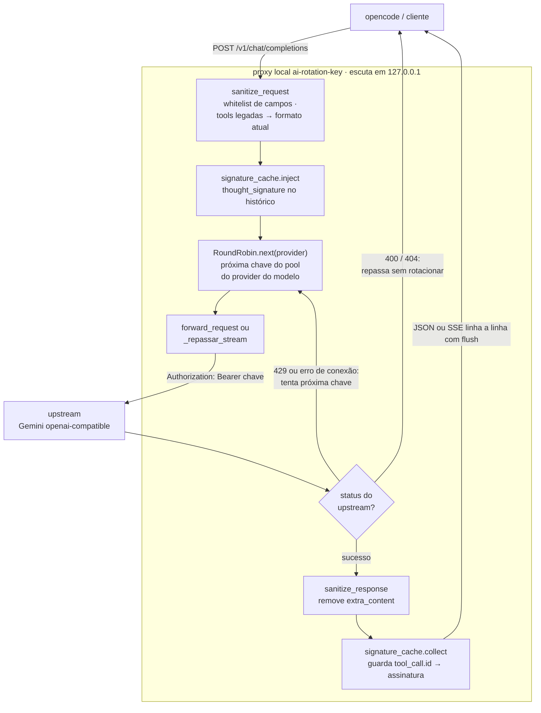

# Arquitetura

CLI + servidor HTTP local que intermedia chamadas OpenAI-compatíveis e distribui o tráfego entre múltiplas chaves por modelo (round-robin). Feito para rodar no Termux: Python puro, zero dependências em runtime e desenvolvimento.

## Fluxo de um request



## Componentes (`src/utils/`, um arquivo por função)

| Módulo | Responsabilidade |
| --- | --- |
| `config_paths` | caminhos do config (`~/.config/ai-rotation-key/`) e porta padrão (8792) |
| `init_config` / `load_config` | cria exemplo idempotente / lê e valida `{"model-keys": {...}, "port": n}` |
| `round_robin` | ciclo por modelo com `itertools.cycle` + lock |
| `sanitize_request` / `sanitize_response` | contratos de entrada/saída e linhas SSE |
| `signature_cache` | `tool_call.id → thought_signature`; coleta na resposta, injeção no histórico |
| `forward_request` | política de rotação contra o upstream (`urllib`) |
| `fetch_models` | GET `{base-url}/models` com Bearer da primeira chave; parseia ids (tira prefixo `models/`) |
| `update_models` | sincroniza o config: adiciona faltantes respeitando `exclude-models` (glob), relatório por provider |
| `start_server` | `ThreadingHTTPServer`, rotas `/v1/*`, escuta apenas em `127.0.0.1` |
| `export_provider` | registra o provider no opencode (idempotente, preserva os demais) |
| `find_free_port` | anti-colisão de porta (+1 até achar livre) |
| `edit_config` | abre o config no `$EDITOR` com fallback `vi` |

## Políticas principais

- **Rotação**: só em HTTP 429 e erro de conexão. 400 (chave inválida/request ruim) e 404 (modelo morto) são repassados ao cliente imediatamente — rotacionar neles só gastaria o pool à toa.
- **Multi-provider**: cada provider tem seu próprio pool de chaves e upstream (`base-url`; gemini tem default embutido, outros precisam declarar). O modelo recebido resolve para exatamente um provider — duplicado no config é erro de carga. Round-robin é por provider: os modelos dele dividem o mesmo ciclo.
- **thought_signature** (Gemini 3.x): a API exige que a assinatura devolvida junto ao functionCall volte no histórico do turno seguinte. O proxy remove o campo da resposta (cliente não vê `extra_content`) e o reinjeta sozinho na próxima requisição.
- **Segurança**: escuta somente em `127.0.0.1`; chaves ficam apenas no config local.
- **Porta**: vem do config (padrão 8792); se ocupada, deriva com +1 e avisa no log.

## Integração com opencode

O comando `export` grava em `~/.config/opencode/config.json` um provider próprio:

```json
{
  "ai-rotation-key": {
    "npm": "@ai-sdk/openai-compatible",
    "options": { "baseURL": "http://127.0.0.1:<porta>/v1", "apiKey": "sk-dummy" },
    "models": { "<seus-modelos>": { "name": "<seus-modelos>" } }
  }
}
```

O bloco usa o pacote [`@ai-sdk/openai-compatible`](https://sdk.vercel.ai/docs/ai-sdk-core/openai-compatibility) da Vercel AI SDK — é ele quem faz o opencode falar o protocolo `/v1/chat/completions` com o proxy. Nunca sobrescreva providers embutidos (ex.: `openai`): o opencode passaria a usar a Responses API e hijackaria o small_model interno.

## Testes

100% stdlib, sem rede nem chave real:

- `tests/mock_server.py`: upstream fake com rotas *as-is* (respostas registráveis em fila, streaming SSE, queda de conexão, 429/400/404), `reset()` por teste, porta efêmera por padrão.
- Suíte sequencial (1 worker): `python -m unittest discover -s tests -v`

## Limitações conhecidas

- Se o proxy reiniciar no meio de uma conversa com tools, as assinaturas anteriores se perdem (cache é em memória) — a próxima chamada pode dar 400 até um novo tool call.
- Rotação em streaming cobre erros antes do primeiro chunk; queda no meio do stream repassa o que chegou.
- Um único gateway por vez no config (`model-keys` global); múltiplos gateways ficam para versões futuras.

## Inspiração e créditos

- [LiteLLM](https://github.com/BerriAI/litellm) — referência de estratégias de roteamento (cooldown, allowed_fails). Aqui vencemos com round-robin simples por request.
- [Hydra-gemini](https://github.com/LikithMeruvu/Hydra-gemini) — inspiração no failover por exclusão de combinações chave/modelo e na regra de ouro "1 chave = 1 projeto Google".
- [Vercel AI SDK](https://sdk.vercel.ai/) — o provider gerado pelo `export` depende do pacote `@ai-sdk/openai-compatible`.
